

# Car market

* [Описание](#описание)
* [Функционал](#функционал)
* [Технологии](#технологии)
* [Архитектура](#архитектура)
* [Интерфейс](#интерфейс)
* [Документация JavaDoc](#javadoc)
* [Тесты](#тесты)
* [Автор](#автор)
* [Критика и предложения](#критика_и_предложения)

## Описание
MVC CRUD приложение - площадка по продаже машин.
Хранение данных при помощи Hibernate.

## Функционал
* Регистрация пользователя
* Аутентификация на сервлет-фильтрах
* Авторизация через БД PostgreSQL
* Добавление объявления с полями:
    1. Марка(из выпадающего списка)
    2. Модель
    3. Цвет(из выпадающего списка)
    4. Категория(из выпадающего списка)
    5. Год выпуска(из выпадающего списка)
    6. Пробег
    7. Цена
    8. Фото(загрузка через Apache Commons FileUpload)
* Пометить статус объявления как "Продано". Доступно только авторизованному владельцу.
* Фильтрация объявлений:
    1. За последний день
    2. С фото
    3. По марке

## Технологии
* Hibernate
* Java14
* JDBC
* PostgreSQL
* AJAX jquery
* Servlet&JSP
* HTML, CSS, BOOTSTRAP
* Apache Tomcat Server
* Junit, Hamcrest, Mockito, Powermock
* Travis CI
* Checkstyle

## Архитектура

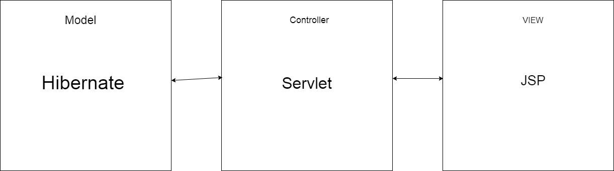

Проект реализован по шаблону MVC и разделён на слои:

1. Хранилища(Model)

    1.1 [HibernateUserStore](src/main/java/ru/job4j/carmarket/store/HibernateUserStore.java) - 
    Hibernate-хранилище для авторизационных данных пользователей.
    
    1.2 [HibernateAdvertisementStore](src/main/java/ru/job4j/carmarket/store/HibernateAdvertisementStore.java) - 
    Hibernate-хранилище для объявлений.
    
2. JSP - View
    
    2.1 [index.jsp](src/main/webapp/index.jsp) - главная страница приложения.
    На ней отображаются все объявления. Так же фильтры, с помощью которых можно
    скорректировать список отображаемых объявлений.
    2.2 [auth.jsp](src/main/webapp/auth.jsp) - страница авторизации. Поддерживает валидацию данных.
    Если пользователя с данным логином не существует, или пароль неверен, 
    будет выведено всплывающее окно с ошибкой.
    2.3 [reg.jsp](src/main/webapp/reg.jsp) - страница регистрации. Поддерживает валидацию даннных.
    Если пользователь с введённым логином уже существует, будет выведено всплывающее окно
    с ошибкой.
    2.4 [add.jsp](src/main/webapp/add.jsp) - страница добавления нового объявления.
    
3. Сервлеты - Controller
    
    3.1 [AuthServlet](src/main/java/ru/job4j/carmarket/servlet/AuthServlet.java) - 
    Сервлет авторизации. Принимает запрос с JSP, производит валидацию введённых
    пользователем данных, существует ли в PostgreSQL хранилище такой пользователь. В случае успешной авторизации, добавляет
    пользователя в Http-сессию.   
    
    3.2 [RegServlet](src/main/java/ru/job4j/carmarket/servlet/RegServlet.java) - 
    Сервлет регистрации. Принимает запрос с JSP, производит валидацию. В случае успешной
    регистрации добавляет нового пользователя в PostgreSQL- хранилище и в Http-сессию, производит
    авторизацию.   
    
    3.3 [IndexServlet](src/main/java/ru/job4j/carmarket/servlet/IndexServlet.java) - 
    Функции сервлета:
        
        * doGet метод - отправка в качестве аттрибута запроса списка объявлений в соответствии с установленным фильтром, данных
                        о текущем авторизованном пользователе. На JSP эти данные будут извлекаться с помощью JSTL
        * doPost метод - на него поступают POST-запросы с JSP одного вида - проставить статус объявления
                         как "Продано". Важно, что это может сделать авторизованный пользователь, разместивший
                         это объявление.
    
    3.4 [DownloadServlet](src/main/java/ru/job4j/carmarket/servlet/DownloadServlet.java) - 
        
        * doGet метод - возвращает в теле ответа картинку, имя которой
          передали в запросе в качестве параметра.
    
    3.5 [AddServlet](src/main/java/ru/job4j/carmarket/servlet/AddServlet.java) - 
        
        * doGet метод - отправляет нужные данные для JSP(списки значений для выпадающих списков на странице
          добавления объявления).
    
4. Фильтры
    
    4.1 [AuthFilter](src/main/java/ru/job4j/carmarket/filter/AuthFilter.java) - 
    Блокирует доступ неавторизованному пользователю ко всем страницами приложения,
    кроме страниц авторизации и регистрации.
    
    4.2 [CorsFilter](src/main/java/ru/job4j/carmarket/filter/CorsFilter.java) - 
    Cross-Origin-Resource-Sharing фильтр. Допускает междоменные запросы, когда
    клиент и сервер находятся на разных машинах.
     
## Интерфейс
1. Регистрация.

    1.1 Зарегистрируемся.
    
    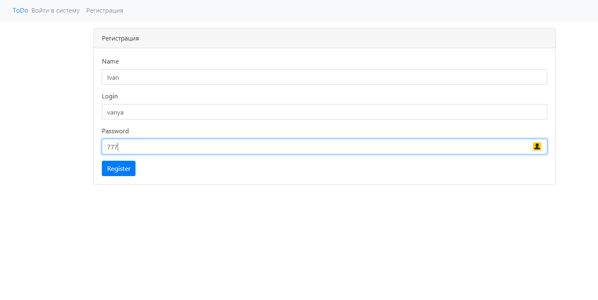
    
    1.2 Попробуем ещё раз зарегистрироваться с этими же данными.
    
    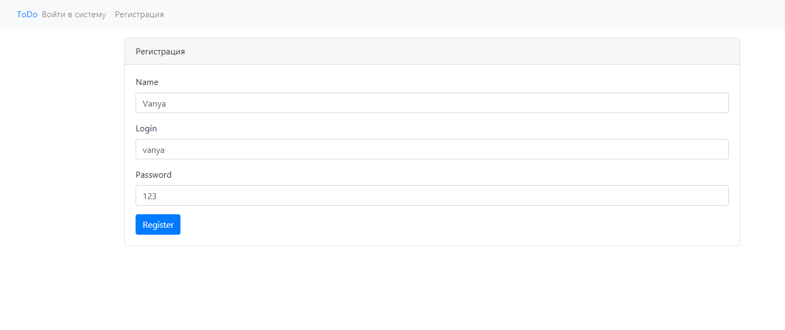 
    
    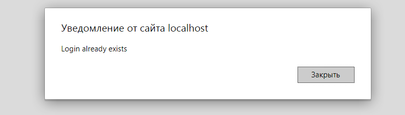

2. Авторизация.

    2.1 Попробуем авторизоваться с несуществующим e-mail
    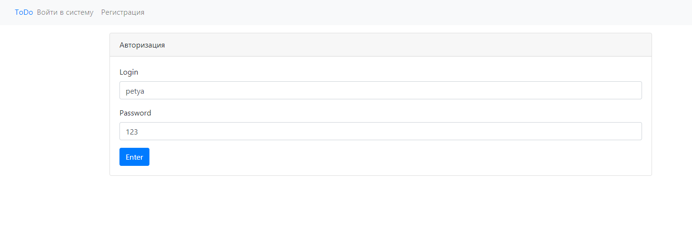
    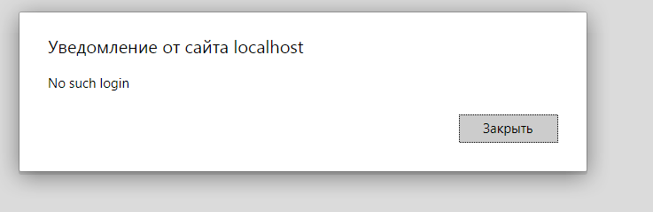
    2.2 Попробуем авторизоваться с неверным паролем
    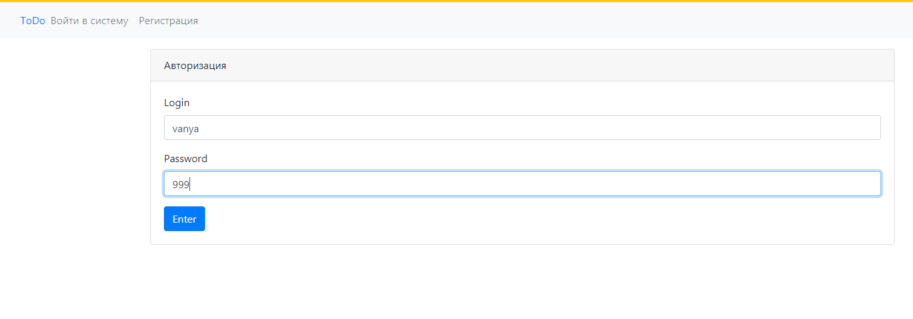
    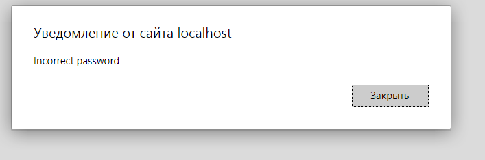
    2.3 Авторизуемся с верными данными
    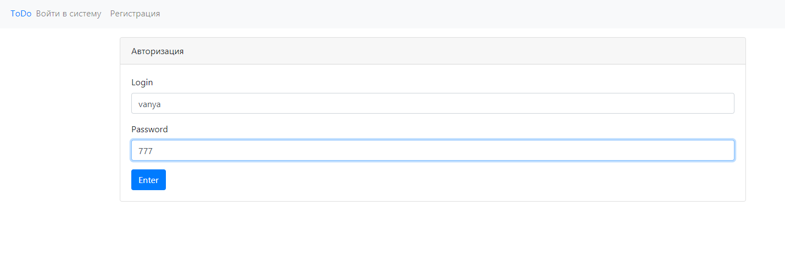
    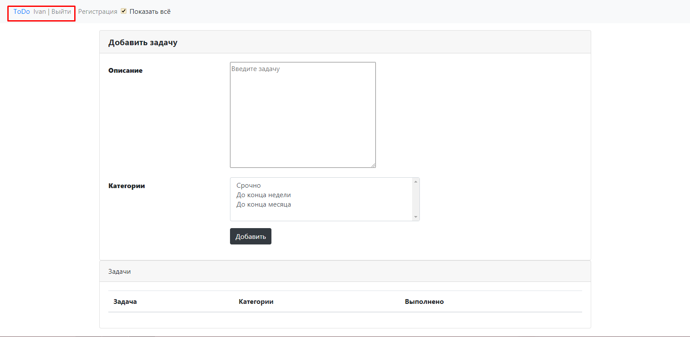

3. Объявления.
    
    3.1 Пока что объявлений нет, страница пуста.
    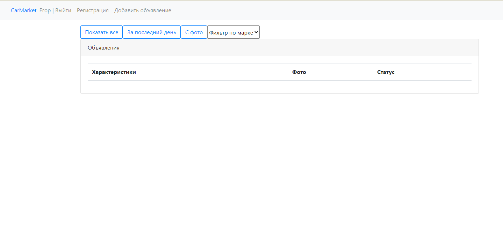
    
    3.2 Добавим объявление
    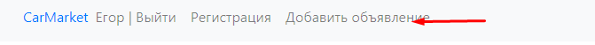
   
    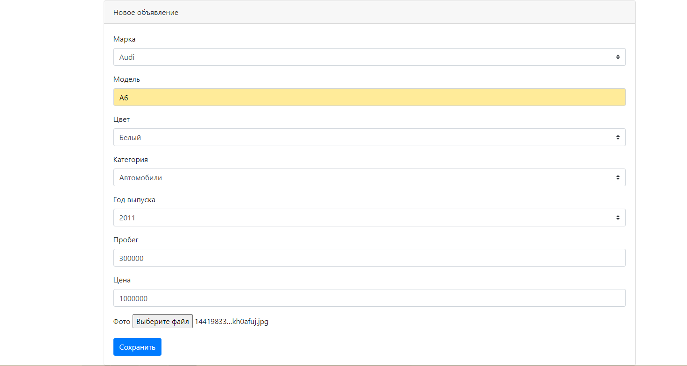
    
    Видим, что объявление добавилось:
    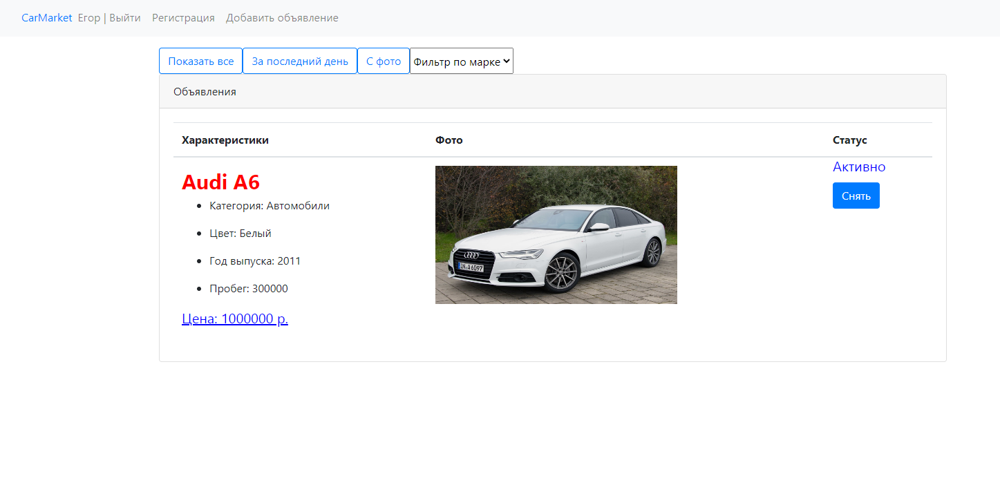
    
    3.3 Добавим ещё несколько объявлений:
    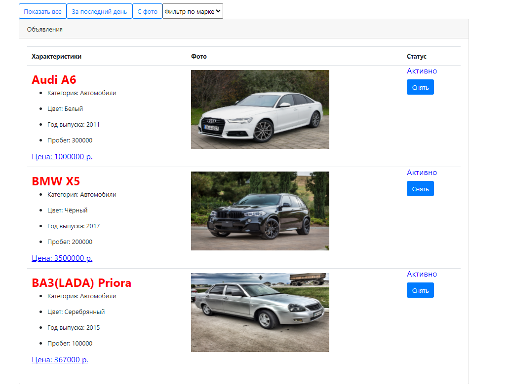
    
    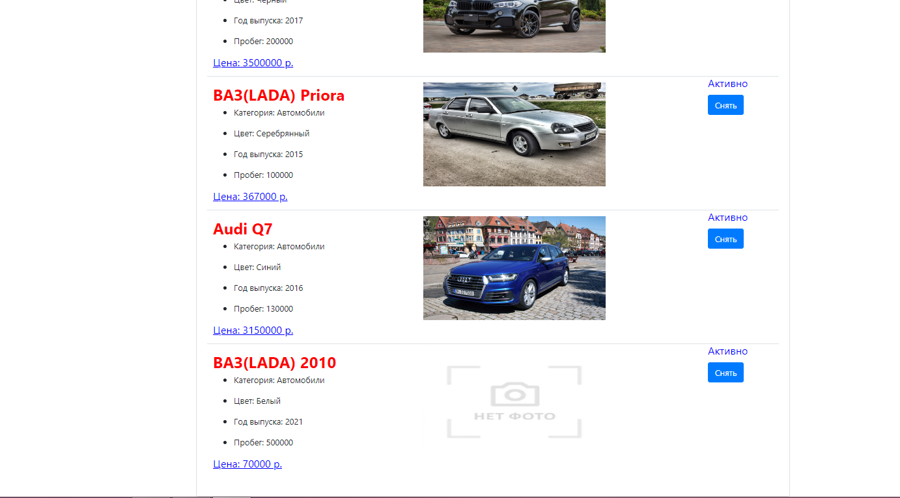
    
    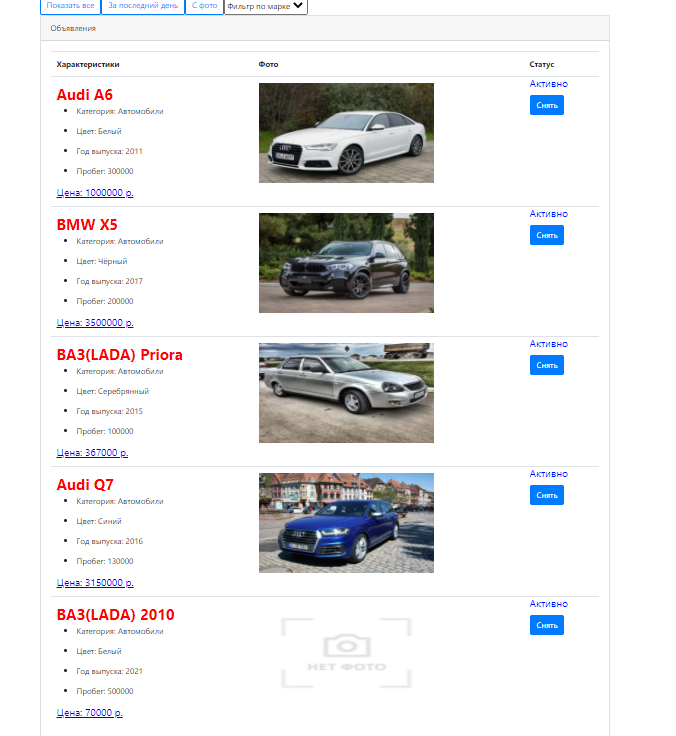
    
    3.4 Отфильтруем, оставим только с фото:
    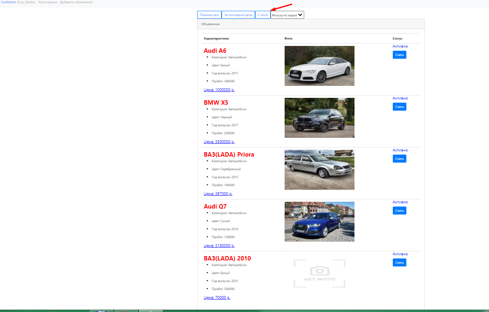
    
    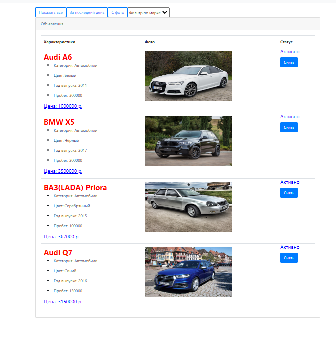
    
    3.5 Отфильтруем по марке Audi:
    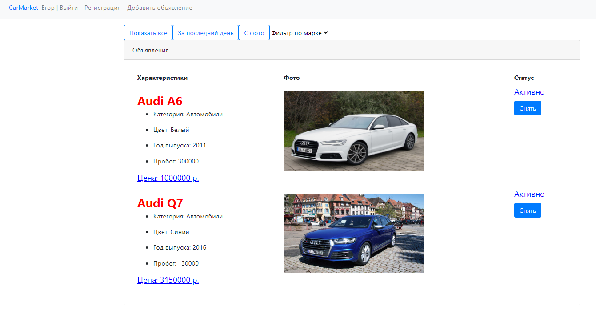
    
    3.6 Снимем BMW с продажи:
    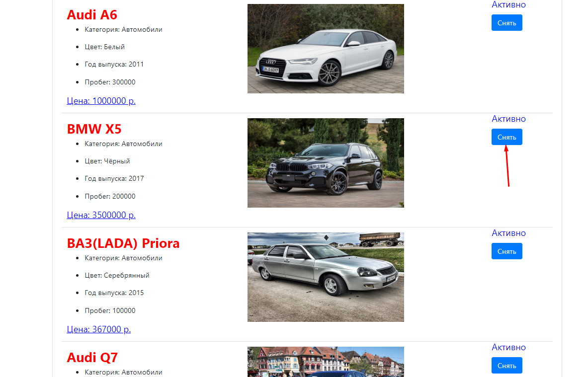
    
    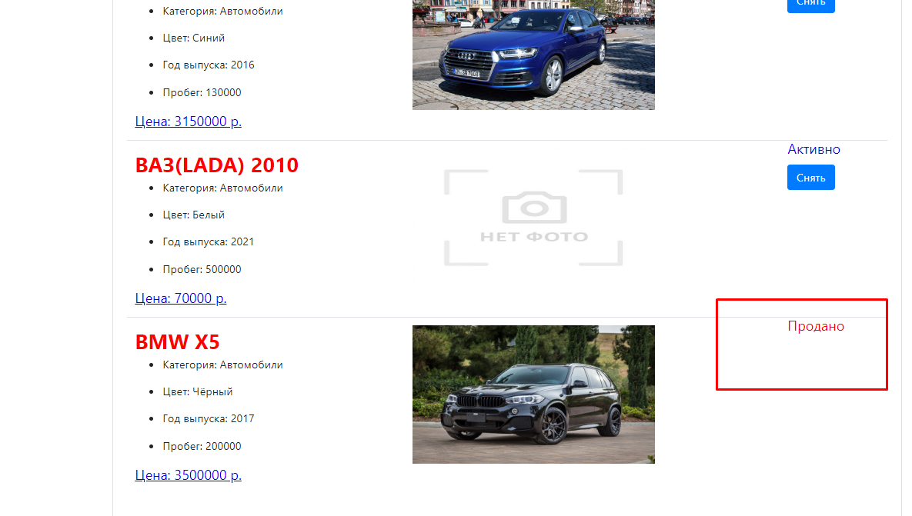
    
    3.7 Зарегистрируемся и зайдём с другого аккаунта.
        Возможность снимать объявления с продажи пропала.
        
    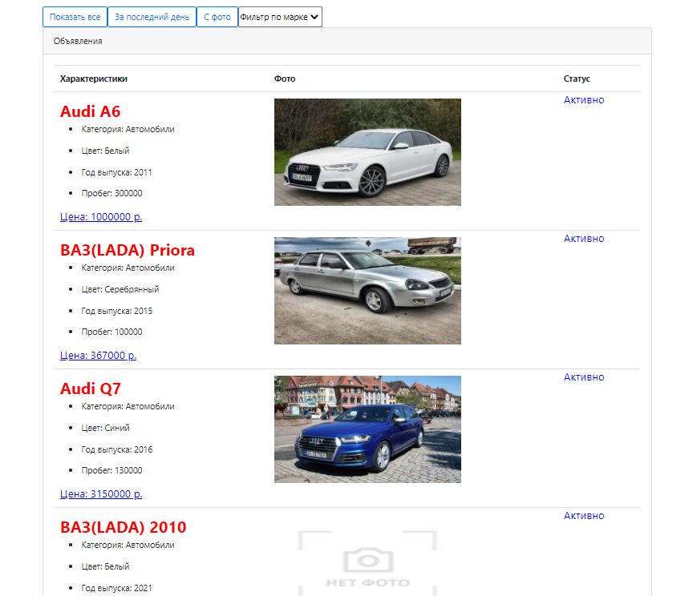    
    
    
## JavaDoc
TODO

## Тесты
На сервлеты написаны тесты с 
применением технологий Mockito и Powermock:
* [AuthServletTest](src/test/java/ru/job4j/carmarket/servlet/AuthServletTest.java) - 
тесты на AuthServlet
* [RegServletTest](src/test/java/ru/job4j/carmarket/servlet/RegServletTest.java) - 
тесты на RegServlet

Интеграционные тесты на Hibernate-хранилища с применением HsqlDB: 
* [HibernateAdvertisementStoreTest](src/test/java/ru/job4j/carmarket/store/HibernateAdvertisementStoreTest.java)
* [HibernateUserStoreTest](src/test/java/ru/job4j/carmarket/store/HibernateUserStoreTest.java)

## Автор

Гераськин Егор Владимирович

Java-разработчик

yegeraskin13@gmail.com

+79271506651

## Критика_и_предложения
Все замечания и пожелания по этому проекту просьба направлять мне 
на электронный адрес: yegeraskin13@gmail.com